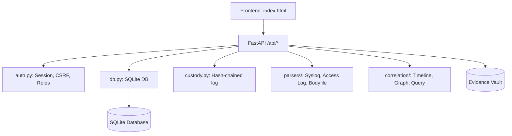

# Person 4 Reconnaissance

## Architecture & Existing Setup

- **Backend Framework**: FastAPI. The entry point is `app/main.py`. The app is initialized with a `lifespan` handler that creates the DB schema (`db.init_db()`). Routes are defined using standard FastAPI decorators (e.g., `@app.get(...)`).
- **Frontend & Static Files**: Served via `app.mount("/static", StaticFiles(directory=STATIC))`. The frontend is a single static HTML file (`static/index.html`) using raw vanilla JS and CSS variables (design tokens like `--steel`, `--ok-bg`), avoiding any external CDNs.
- **SQLite Database**: Managed in `app/db.py`. The `SCHEMA` string handles all table creations. Connections are fetched via a `connect()` function and a `@contextmanager def session()` which handles transactions (commit on success, rollback on exception).
- **Auth**: Handled in `app/auth.py`. Sessions are stored in the DB using the `sessions` table (with hashed tokens) and returned as an `HttpOnly`, `SameSite=Strict` cookie (`idff_session`). Login lockout exists (5 failures per IP/username per 15 mins). CSRF is mitigated via an `X-Requested-With: idff` header required for state-changing routes. Existing roles: `admin`, `investigator`, `examiner`, `supervisor`, `reviewer`, `auditor`. All users currently see all cases because `list_cases` and other routes simply query `SELECT * FROM cases` without filtering by the active user.
- **Custody Log**: Implemented in `app/custody.py`. It uses a hash-chained mechanism where `entry_hash = SHA256(prev_hash || canonical_json(entry))`. It relies on Python's `json.dumps` with `sort_keys=True, separators=(",", ":")` for canonicalization. It's invoked via `custody.append(...)` in the same `db.session()` context as the parent action, meaning it's committed atomically. It currently covers `ts`, `case_id`, `evidence_id`, `actor`, `action`, and `detail`. It checks integrity dynamically via `verify_chain()`.
- **Person 2 Endpoints**: Added in `app/main.py` (`/timeline`, `/graph`, `/query`) using helper modules `app/correlation/timeline.py`, `graph.py`, `query.py`.
- **Tests**: Present in `tests/test_intake.py` using `pytest` and `TestClient`. It uses a temporary directory for `FORENSIC_DATA_DIR` per test.
- **Docker**: A standard `Dockerfile` uses `python:3.12-slim`, sets up an `idff` non-root user, and exposes a volume for the data directory `/data` (`FORENSIC_DATA_DIR=/data`).

## Mermaid Diagram

## Existing vs. Missing Table

| Feature | Already Exists | Missing (My Job) |
|---|---|---|
| **Case Management & RBAC** | Global roles, basic case fields, open cases view. | Per-case assignment (`case_members`), need-to-know DB filtering, case status lifecycle, declarative permission matrix, legacy migration switch. |
| **Immutable Audit Trail** | Hash-chained `custody_log`, basic API for checking chain. | SQLite triggers blocking UPDATE/DELETE, Ed25519 signing/anchoring, offline verifier script, PDF certificate generation, tamper simulation. |
| **Synthetic Sandbox** | N/A | Sandbox engine, injection templates, detection hooks, isolation proofs (hash before/after), synthetic scoreboard, and UI implementation. |

## Files to Touch (Smallest Possible Diffs)

- `app/db.py`: Extend `SCHEMA` (add `case_members`, `audit_anchors`, SQLite triggers on `custody_log`, `sandbox_runs`). Add fields to `cases`.
- `app/main.py`: Inject the new `get_case_or_403` dependency into all existing routes. Add API endpoints for assigning members, sandbox execution, certificate generation, tamper simulation.
- `app/auth.py`: Modify or wrap `require` logic to support the declarative permission matrix.
- `app/custody.py`: Add Merkle anchoring and signing triggers. 
- `static/index.html`: Update UI with the new tabs, badge, side-by-side sandbox, and tamper simulation button.
- `tests/test_intake.py`: Add tests for RBAC, Sandbox isolation, and anchor verification.
- `requirements.txt`: Add `cryptography` (for Ed25519) and `reportlab` (for PDF generation).
- `tools/verify_audit.py`: **New File**, a standalone verification script.

## Merge-Conflict Hotspots
- `app/main.py` routing, since Person 3 is currently adding endpoints for AI summarisation.
- `static/index.html` navigation and tab management.
- `tests/test_intake.py` imports and fixtures.

## Adjusted Milestone Plan
- **Phase 0**: Onboard, run tests, fix timezone issue, output docs (Done).
- **M1/M2 (Case Management & RBAC)**: Add `case_members` table and the `get_case_or_403` check. Extend case schemas. Ensure idempotent DB backfill. Implement the declarative permission matrix.
- **M3/M4 (Audit Trail)**: Add SQLite triggers on `custody_log`. Implement Ed25519 signatures, `tools/verify_audit.py`, and `reportlab` PDF output. Build tamper simulation.
- **M5/M6 (Sandbox)**: Create the copy-on-write `sandbox_runs` tables, add injection mechanisms, the scoreboard, and isolation proofs. Add UI.
